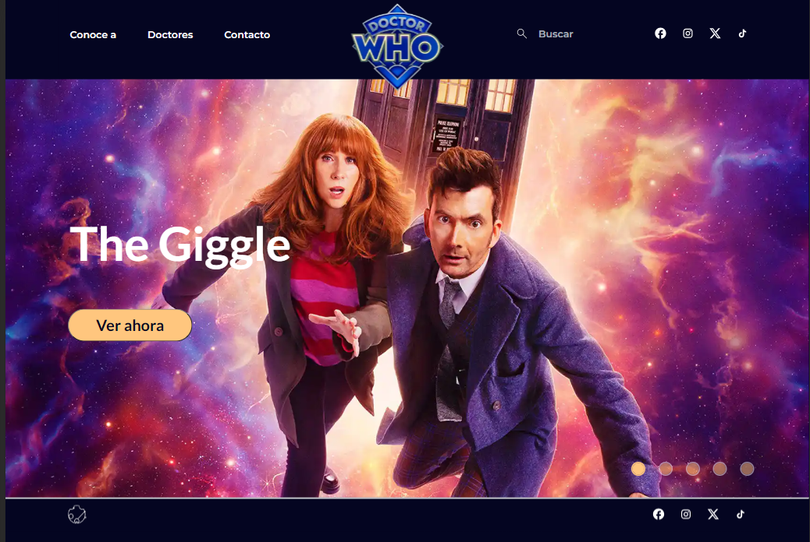
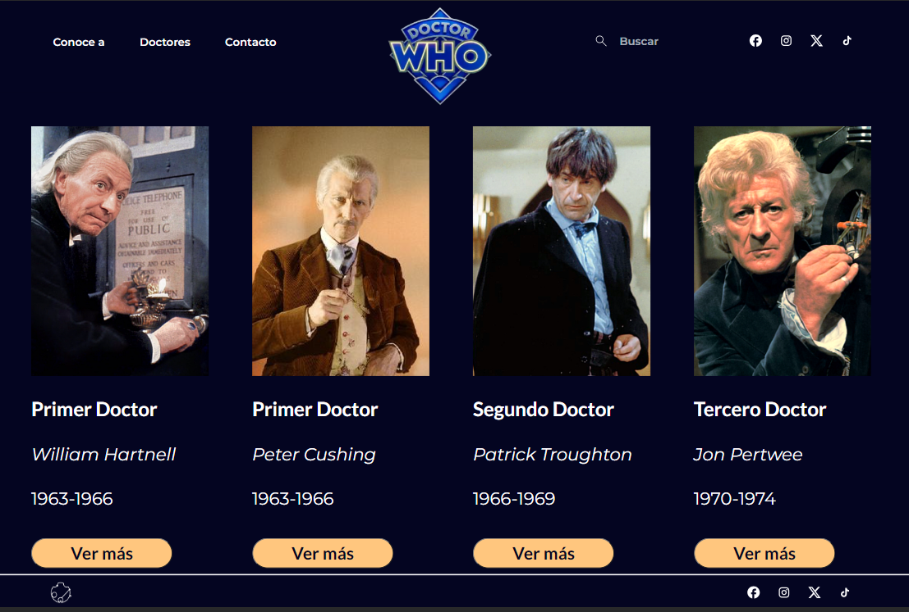
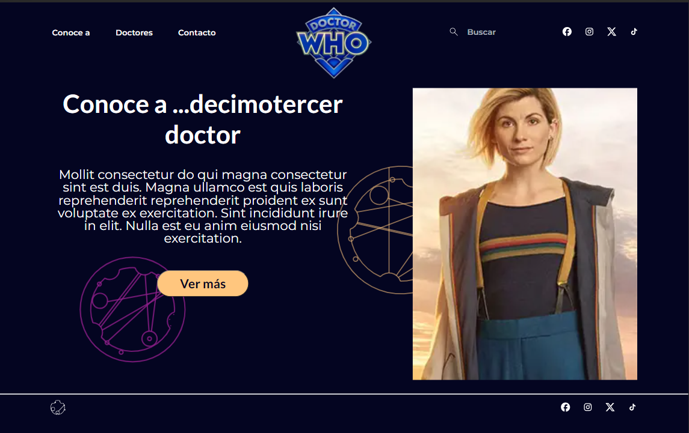
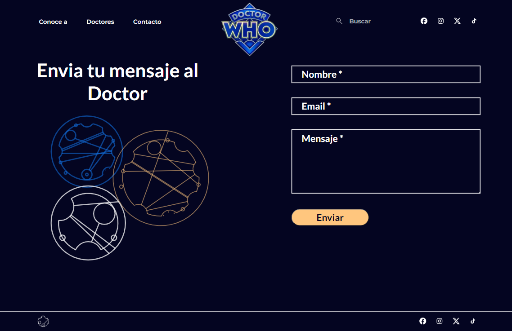

# Doctor Who App

Welcome to the Doctor Who App, your ultimate guide to the fascinating world of Doctor Who! This web application is built using Next.js 14, Bootstrap, Sass, and Vite. Explore information about Doctor Who characters, find detailed profiles, and get in touch with us through the contact page.

## Table of Contents

1. [Getting Started](#getting-started)
2. [Features](#features)
3. [Technologies used](#technologies-used)
3. [Installation](#installation)
4. [Images](#usage)
5. [Contributing](#contributing)

## Getting Started

To get started with the Doctor Who App, simply follow the installation instructions below.

## Features

- **Landing Page:** An engaging landing page with a carousel of images, to welcome users and set the tone for the Doctor Who experience.

- **Character Information Page:** Explore details about various Doctor Who characters, their backgrounds, and roles in the Doctor Who universe.

- **Search Bar:** Use the search bar to filter characters by Doctor's name or actor's name.

- **Search Results Page:** A dedicated page displaying search results based on the entered criteria. Find the information you're looking for quickly and efficiently.

- **Contact Page:** Connect with us through the contact page. Whether you have feedback, questions, or suggestions, we'd love to hear from you!

- **Detailed Character Page:** Dive deeper into the world of Doctor Who by accessing detailed information about specific characters.

## Technologies Used

- **Next.js 14:** React framework 

- **Bootstrap:** Front-end framework

- **Sass:** To enhance stylesheets 

- **Vitest:** For testing

## Installation

1. Clone the repository:

   ```bash
   git clone https://github.com/vicki-robertson/nextjs-dr-who.git

2. Install dependencies:

    ```bash
    npm install

3. Run the development server:

    ```bash
    npm run dev

Open your browser and navigate to http://localhost:3000 to explore the Doctor Who App.

## Images
Photos of the App on desktop devices

### Landing Page


### Doctor's Page


### About... Page


### Contact Page


## Contributing

If you're a Doctor Who enthusiast and would like to contribute to the app, feel free to fork the repository, create a branch for your contributions and then submit pull requests with improvements, bug fixes, or additional features. Your contributions are greatly appreciated!


Happy exploring through time and space with the Doctor Who App! 🌌🕰️

